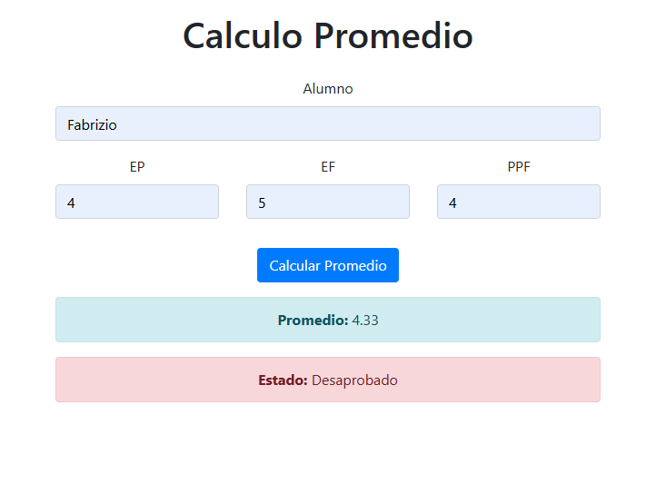

# Cálculo de Promedio de Alumnos

Este proyecto web desarrollado en PHP permite calcular el promedio de un alumno basado en las notas de evaluaciones parciales (EP), evaluación final (EF) y trabajo práctico/proyecto final (PPF). Utiliza una interfaz sencilla construida con Bootstrap 4 para garantizar un diseño moderno y responsivo.

## Imagen del Proyecto

## Características Principales

- **Formulario de Entrada:** Permite ingresar el nombre del alumno, las notas de EP, EF y PPF.
- **Cálculo Automático:** Calcula el promedio y determina automáticamente si el alumno está "Aprobado" o "Desaprobado".
- **Diseño Responsivo:** Utiliza Bootstrap 4 para adaptarse a diferentes dispositivos y tamaños de pantalla.
- **Retroalimentación Visual:** Muestra el resultado del promedio y el estado del alumno con colores distintivos (verde para aprobado, rojo para desaprobado).

## Tecnologías Utilizadas

- **PHP:** Lógica del servidor para calcular el promedio y determinar el estado del alumno.
- **HTML/CSS:** Estructura y estilos básicos de la interfaz de usuario.
- **Bootstrap 4:** Framework de CSS para diseño responsivo y componentes frontend.

## Archivos Principales

- **index.php:** Página principal que contiene el formulario de ingreso y la lógica de presentación.
- **alumno.php:** Clase PHP que encapsula la lógica de cálculo del promedio y estado del alumno.
- **style.css:** Estilos adicionales personalizados para complementar Bootstrap.
